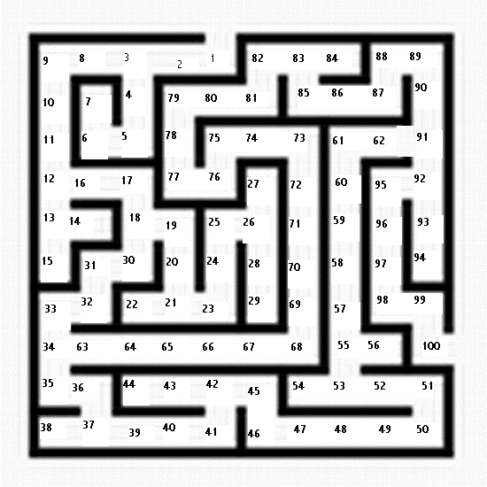

# SP24-SE-CSCI-C455-Xavbeat03-Homework-Assignment-6
Creating and implementing an A* algorithm to solve simple mazes

## Assignment
Implement the A* shortest path algorithm to find the shortest path in a maze. The algorithm you need is discussed in class and can be found here.  You may pick a suitable heuristic function but identify it in a comment line in the code. You can test your program using the following mazes; test-maze.txt Download test-maze.txt, test-maze2.txt Download test-maze2.txt, and maze.txt Download maze.txt. I discussed the test-maze2.txt in class.

You should submit your C++ program, and the three outputs (shortest paths, and the total cost of the path) via Canvas.